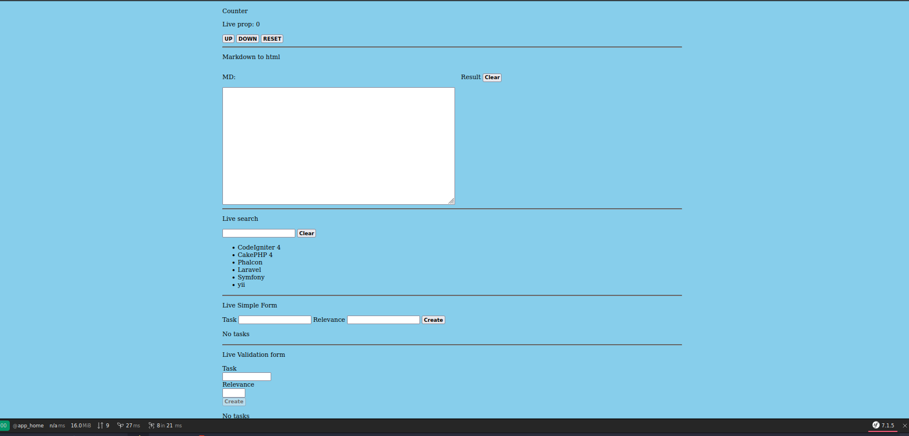
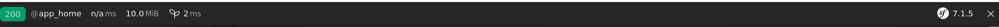

# Symfony App with Live components ( twig + Stimulus )

### Date creation:

2024-10

### Tech

- PHP 8.3

- Symfony 7.1

- Symfony AssetMapper ( Simple, Modern CSS & JS Management )

- Twig template engine

- Twig base component  ( ux-twig-component )

- Stimulus js ( for live components with twig)

- Apache web server ( with Docker)


### About

this project show:

>Live components builds on top of the TwigComponent library to give you the power to automatically update your Twig components on the frontend as the user interacts with them. 
Inspired by Livewire and Phoenix LiveView.

 -- [Symfony Docs](https://symfony.com/bundles/ux-live-component/current/index.html)

 
Examples in this project:

- Counter

- Live search 

- Markdown preview

- Simple form

- Validation form

### image:


## install as micro framework

```bash
composer create-project symfony/skeleton:"7.1.*" my_project_directory
```

or on current dir / folder

```bash
composer create-project symfony/skeleton:"7.1.*"  ./
```

## if your are using Apache server

```bash
composer require symfony/apache-pack
```

this install / copy .htaccess config file


## install cli code generator: Make

```bash
composer require --dev symfony/maker-bundle
```

as recipe, alias - `generator`, `make`, `maker`, `maker-bundle`, `makerbundle`

```bash
composer require make
```

list of others recipes:

[Flex recipes](https://github.com/symfony/recipes/blob/flex/main/RECIPES.md)


## installing template engine: Twig

```bash
composer require symfony/twig-bundle
```

as recipe, alias - `twig-bundle`, `twigbundle`

```bash
composer require twig-bundle
```

## The Web Debug Toolbar (optional)



```bash
composer reqire symfony/profiler-pack
```

as recipe, alias - `web-profiler-bundle`, `webprofilerbundle`

```bash
composer require webprofilerbundle
```

## Asset Mapper

> The AssetMapper component lets you write modern JavaScript and CSS without the complexity of using a bundler. Browsers already support many modern JavaScript features like the import statement and ES6 classes. And the HTTP/2 protocol means that combining your assets to reduce HTTP connections is no longer urgent. This component is a light layer that helps serve your files directly to the browser.

-- [Symfony Docs](https://symfony.com/doc/current/frontend/asset_mapper.html)


```bash
composer require symfony/asset-mapper symfony/asset symfony/twig-pack
```

## Symfony components

> Twig components give you the power to bind an object to a template, making it easier to render and re-use small template "units" - like an "alert", markup for a modal, or a category sidebar

-- [Symfony docs](https://symfony.com/bundles/ux-twig-component/current/index.html)


```bash
composer require symfony/ux-twig-component
```

as recipe, alias - `ux-twig-component`, `uxtwigcomponent`

```bash
composer require ux-twig-component
```

## live component

[docs](https://symfony.com/bundles/ux-live-component/current/index.html)

```bash
composer require symfony/ux-live-component
```

or as recipe, alias - `ux-live-component`, `uxlivecomponent`

```bash
composer require ux-live-component
```

## CSRF TOKEN security

> When you trigger an action, a POST request is sent that contains a custom Accept header. This header is automatically populated and validated. In other words… you get CSRF protection without any work thanks to same-origin / CORS policies implemented by browsers.

[docs Live components ](https://symfony.com/bundles/ux-live-component/current/index.html#writable-object-properties-or-array-keys)

[install csrf](https://symfony.com/doc/current/security/csrf.html)

```bash
composer require symfony/security-csrf
```

And activate to apply on headers

[docs](https://symfony.com/doc/current/reference/configuration/framework.html#reference-framework-csrf-protection)

```yaml
# config/packages/framework.yaml
framework:
    # ...
    csrf_protection: true
```

## Rendering Markdown Content (optional)

```bash
composer require twig/markdown-extra league/commonmark
```

example of use:

as a simple filter:

```twig
{{ '# MD'|markdown_to_html }}
```

or 

```twig

    Welcome {{ email.toName }}!
    ===========================

    You signed up to our site using the following email:
    `{{ email.to[0].address }}`

    [Activate your account]({{ url('...') }})

```

## Validation

[docs](https://symfony.com/doc/current/validation.html)

```bash
composer require symfony/validator
```

as recipe, `validation`, `validator`:

```bash
composer require validator
```